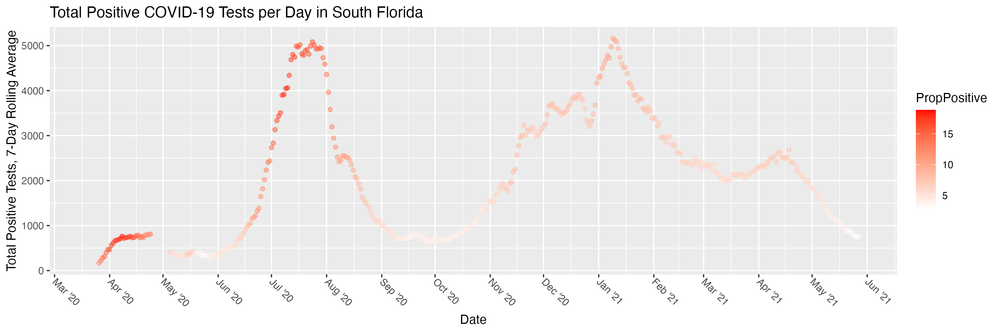
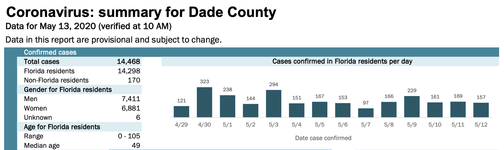
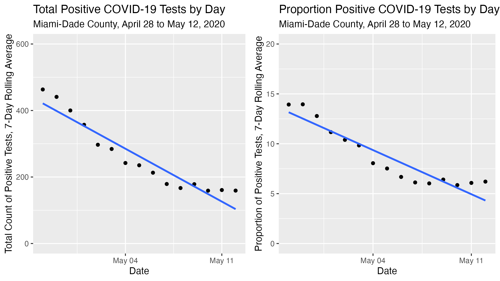
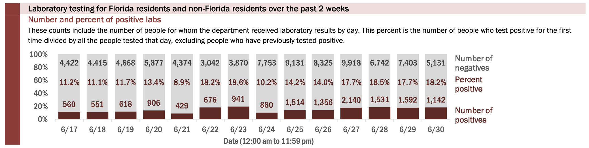
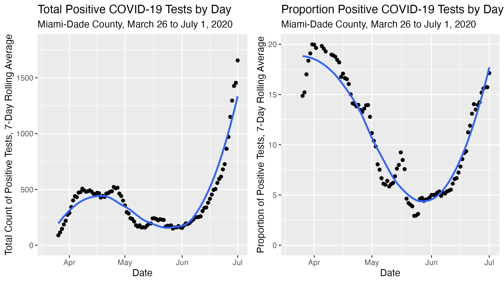
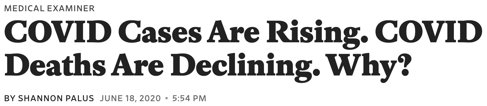
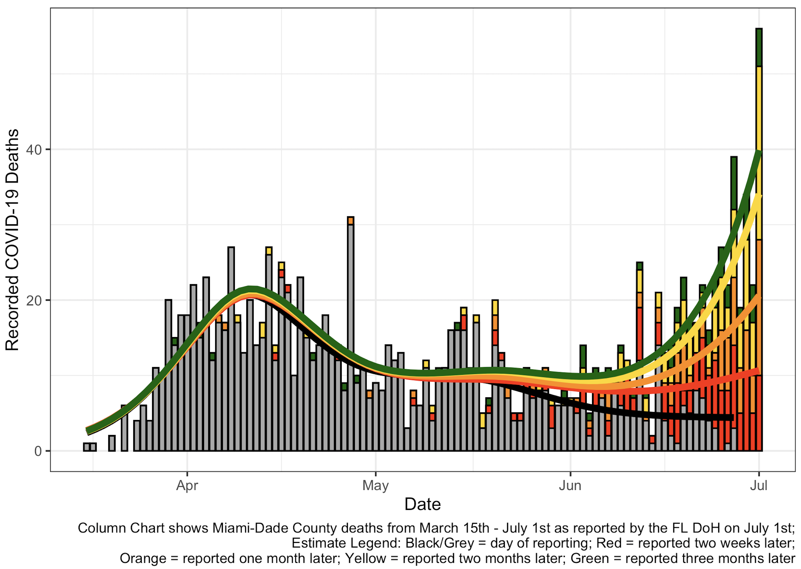
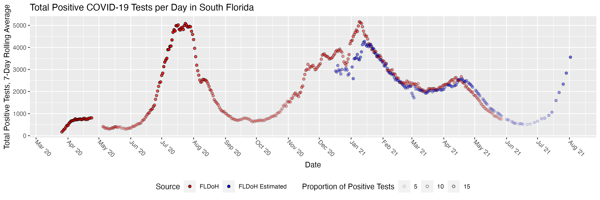

# Outline

- Overview and Pandemic Timeline
- Question 1: *What are the recent trends?*
- Question 2: *Are we better now, or worse?*
- Question 3: *Are we reporting COVID-19 deaths correctly?*
- Summary and Closing Thoughts

 

Slides available at <https://rpubs.com/gabrielodom/JSM_2021_COVID_visuals>

 

**DISCLAIMER**: all data is from the Florida Department of Health unless otherwise stated

# Overview and Pandemic Timeline

## The COVID-19 Epidemic in South Florida

- COVID-19 is a highly contagious respiratory infection caused by the novel coronavirus SARS-Cov-2
- The incubation period is [2-14 days](https://www.cdc.gov/coronavirus/2019-ncov/symptoms-testing/symptoms.html), so observed data lags community transmission 1-2 weeks
- The South Florida (SFL) metropolitan region is comprised of Miami-Dade, Broward, and Palm Beach counties
- There are roughly 6.4 million people in these three counties (30% of the state's total population)
- As of [today](https://www.nytimes.com/interactive/2021/us/florida-covid-cases.html), Florida has had 2.7 million COVID-19 cases (1 million in SFL) and 39965 deaths (`r format(eval(6472 + 3079 + 2883), scientific = FALSE)` in SFL) since March 5, 2020

## COVID-19 Epidemic Timeline in South Florida

- **First Wave**: Early March (second week) to mid-May 2020
- **Second Wave**: Mid-June through August 2020
- **Third Wave**: Late October 2020 through 2021 "Spring Break" Season and ending in May 2021 
- **Fourth Wave**: Mid-July 2021 to current (shown later)

# Question 1: What are the recent trends?

## Context: The First Wave (Mar-May 2020)

- March 16, 2020: confirmed "Patient Zero" in Miami-Dade 
- March 28, 2020: Gov. DeSantis issues a "Safer at Home" order (a lockdown) effective April 1st and required all hospitals to report their COVID-19 data to the state daily
- Early April 2020: representatives for local elected officials reached out to us for help understanding trends in the data they were receiving daily (example report excerpt below)

## Figure: 14-Day Trends

## Decision to Reopen
- In mid-April 2020, the White House released [reopening guidelines](https://www.pbs.org/newshour/nation/white-house-coronavirus-guidelines-call-for-reopening-public-life-in-phases) based on 14-day trends in testing, positivity rates, and hospital capacity (*Note: at this point, the state of the science was that SARS-Cov-2 was primarily spread via surface contact*)
- The 14-day trend of case counts and test positivity rates became negative in early May, and hospitals had sufficient capacity
- On May 18, 2020, Miami-Dade County lifted the lockdown restrictions

# Question 2: Are we better now, or worse?

> "Nothing could be older than the daily news, nothing deader than yesterday's newspaper." - Edward Abbey

## Context: The Second Wave (June-Sept 2020)

- At the end of the spring school semesters and after the Memorial Day holiday (May 25), cases began to rise
- The Florida Department of Health (FLDoH) reported testing data for the most recent 14 days only (below)  

- Local elected and administrative officials struggled to interpret this data, lacking context necessary to compare to the First Wave

## Figure: Contextualizing the Current Spread

## Decision to Require Masks in Public

- Using our figures, local officials were better able to contextualize the current state of affairs in the county than they had been using the tables/figures reported by the state Department of Health
- A "Mask in Public" ordinance had been in place since the end of May, but it was not enforced
- On July 2, 2020, city officials began enforcement of that ordinance
- Note 1: Because of the viral incubation period, "current" testing data and hospitalization data was already too old to measure the current state of community transmission
- Note 2: the county did not lock down because "deaths were decreasing" (more on that next)

# Question 3: Are we reporting COVID-19 deaths correctly?

## Context: Peak of the 2nd Wave (July 2020)

- During the rapid rise of COVID-19 cases and hospitalizations, some of the officials we met with noticed that the number of COVID-19 deaths reported by the state was decreasing, while the number of patients reported to be on ventilators in the hospital was increasing
- Based on the medical experience at the time, we expected [80% of ventilated patients to expire](https://pubmed.ncbi.nlm.nih.gov/33119402/)

 

Was this because COVID-19 was no longer a threat?

---

**NO!**

{width=90%}

## Interpretation

- The grey columns are the reported COVID-19 deaths for March-June, 2020, as reported on July 1, 2020
- The other stacked columns show how the counts for the exact same days will increase over time as more deaths are reported and certified
- Using this figure, we convinced the local officials that daily death counts were completely inappropriate data to use in making health policy decisions
- The local offices of the health department informed us that that medical examiners offices were hopelessly backlogged (Florida required at that time for all COVID-19 deaths to be certified by a medical examiner; [this policy changed in August](https://www.tampabay.com/news/health/2020/08/26/medical-examiners-no-longer-required-to-certify-covid-19-deaths-in-florida/))

## Making Inference

- We no longer have 2-3 month delays in death reporting; this "lag" is 1-3 weeks now, and we have [a better understanding](https://covidtracking.com/analysis-updates/how-lagging-death-counts-muddied-our-view-of-the-pandemic) of the implications of this delay 
- However, even in 2021, these same shoddy and misinterpreted data are still being used to erroneously claim that the Delta variant ["isn't that bad"](https://twitter.com/NateSilver538/status/1423243926421614595)

# Summary

## What We Learned

- We were blessed to have local officials who cared about science, and we were lucky to be able to work with an incredible interdisciplinary team of experts
- Real data is _**messy**_
- Responding to a pandemic is exhausting--our team worked 7 days a week for months on end
- Even very smart people can make bad decisions when data are displayed poorly
- "Hindsight is 20/20"
- We, and all of the people we worked with, made mistakes
- Consider a modification of Hanlon's Razor: "don't attribute to malice what can adequately be explained by inexperience, underfunding, and exhaustion."

## Next steps

- Our paper is [here](https://www.ncbi.nlm.nih.gov/pmc/articles/PMC7994185) (it's open access)
- The emergency order giving us access to the data expired in June 2021, so we have not had access to state data
- We have access to similar data [from the CDC](https://healthdata.gov/Health/COVID-19-Community-Profile-Report/gqxm-d9w9), but they use a different data dictionary
- We are in the process of reverse-engineering the state health department data from the CDC data in order to have an "apples to apples" comparison across the entire pandemic

## Final Thoughts

**Please get vaccinated!**

 

GitHub repository for this presentation: <https://github.com/gabrielodom/JSM_2021_COVID_Visuals>

